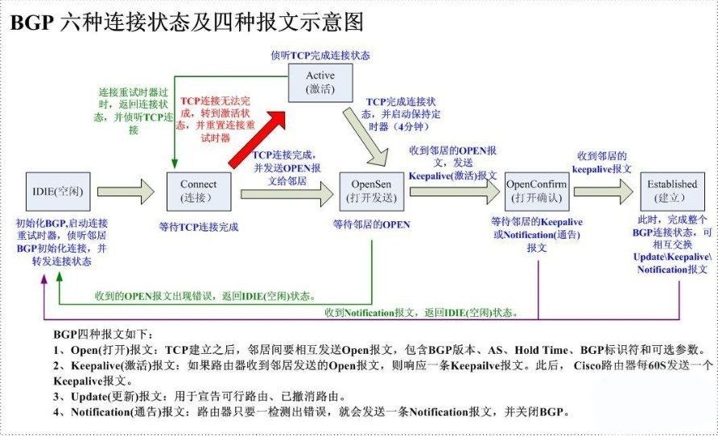

#### As_Path  Type

组成：Path Segment Type,  Path Segment Length,  Path Segment Value

- As_Set: 由一系列As号无序地组成，包含在Updata消息里
- As_Sequence: 由一系列As号顺序地组成，包含在Updata消息里
- As_Confed_Sequence: 在本地联盟内由一系列成员As号按顺序地组成，包含在Updata消息中，只能在本地联盟内传递
- As_Confed_Set: 在本地联盟内由一系列成员As无序地组成，包含在Updata消息中，同样只能在本地联盟内传递

#### BGP Ring Protection

- As内部防环：通过iBGP水平分割实现。从iBGP邻居学到的路由不会更新给其他IBGP邻居。

  若无此机制，那么当三个路由器两两相连，并建立了iBGP邻居时，那么此时其中一个路由器发送的更新路由将在三个路由器之间无限循环

  要实现As内部每台路由器都可以学习到路由，需要建立iBGP邻居全互联（路由器数目很大的时候，那将导致网络中的路由器因为需要维护过多的BGP邻居关系导致性能下降）。可以通过路由反射器，eBGP联邦解决

- As间防环：通过 As path 防环，每经过一个As，会添加该As的As编号在As_Path字段的最前面,当从eBGP邻居得到一条路由时，会检查该路由的As_path字段有没有自身所在As，如果有则，丢弃，如果没有则继续

- RR防环

- SOO防环

#### BGP Route Reflector ( RR )

　在BGP的网络中，为保证IBGP对等体之间的连通性，需要在IBGP对等体之间建立全连接关系。假设在一个AS内部有n台路由器，那么应该建立的IBGP连接数就为n(n-1)/2.当IBGP对等体数目很多时，对网络资源和CPU资源的消耗都很大

​    在一个AS内，其中一台路由器作为路由反射器RR（Route Reflector），RR和Client组成i一个集群（Cluster），其它路由器作为客户机（Client）与路由反射器之间建立IBGP连接。路由反射器在客户机之间传递（反射）路由信息，而客户机之间不需要建立BGP连接

​    既不是反射器也不是客户机的BGP路由器被称为非客户机（Non-Client）。非客户机与路由反射器之间，以及所有的非客户机之间仍然必须建立全连接关系

总结：

- Client只需维护与RR之间的IBGP会话
- Non-Client与Non-Client之间需要建立IBGP全互连
- RR与Non-Client之间需要建立IBGP全互连
- RR与RR之间需要建立IBGP的全互连

##### rule

- 从非客户机IBGP对等体学到的路由，发布给此RR的所有客户机
- 从EBGP对等体学到的路由，发布给所有的非客户机和客户机
- 从客户机学到的路由，发布给此RR的所有非客户机和客户机（发起此路由的客户机除外）
- 从EBGP对等体学到的路由，发布给所有的非客户机和客户机

##### Router Reflector Cluster

当一个AS内存在多台RR为Client提供冗余时，RR间的路由更新很有可能会形成环路，为防止该现象，引入簇（Cluster）的概念

- 通过4字节的Cluster_ID来标识Cluster，通常会使用Loopback地址作为Cluster_ID
-  一个Cluster里可以包括一个或多个RR；一个Client可以同时属于多个Cluster
- 通常，一个客户的簇只拥有一个RR，并由RR的BGP Router-id去标识该簇。有时，为了防止单点失效，在单一簇里引入多个RR。

##### Ring Protection

- Originator_ID
  - Originator_ID属性用于防止在反射器和客户机/非客户机之间产生环路
  - Originator_ID属性长4字节，可选非过渡属性，属性类型为9 ，是由路由反射器（RR）产生的，携带了本地AS内部路由发起者的Router ID
  - 当一条路由第一次被RR反射的时候，RR将Originator_ID属性加入到这条路由，标识这条路由的始发路由器。如果一条路由中已经存在了Originator_ID属性，则RR将不会创建新的Originator_ID
  - 当其它BGP Speaker接收到这条路由的时候，将比较收到的Originator_ID和本地的Router ID，如果两个ID相同，BGP Speaker会忽略掉这条路由，不做处理
- Cluster_List 
  - Originator_ID属性用于防止在RR之间产生环路
  - Cluster_List是可选非过渡属性，属性类型编码为10
  - Cluster_List由一系列的Cluster_ID组成，描述了一条路由所经过的反射器路径，这和描述路由经过的As路径的AS_Path属性有相似之处。Cluster_List由路由反射器产生
  - Cluster_List只在AS内部传播，从EBGP对等体收到的含有Cluster_List的路由将被丢弃。
    当RR在它的客户机之间或客户机与非客户机之间反射路由时，RR会把本地Cluster_ID添加到Cluster_List的前面。如果Cluster_List为空，RR就创建一个
  - 当RR接收到一条更新路由时，RR会检查Cluster_List。如果Cluster_List中已经有本地Cluster_ID，丢弃该路由不需要再反射；如果没有本地Cluster_ID，将其加入Cluster_List，然后反射该更新路由
  - Cluster_List只被RR用来检测路由环路，不是RR的客户机和非客户机不会检测该属性。

#### BGP Confederation

将一个大的As分割成多个小型的As，让As内部拥有足够数量的eBGP邻居关系来解决路由限制问题。

对于外部邻居来说(联盟外的的对等体)，成员AS拓扑是不可见的。也就是说，在发向eBGP邻居的更新消息中，已经剥去了联盟内被修改的As_PATH。从其他的自治系统来看，联盟就像单个As一样。

##### Ring Protection

Confederation内采用As_Confed防止子AS间路由环路

##### Confederation内As_Path属性变化

```
//示意图
            |-------->  As 200 <----------------|            
As(100) --> As((1000),100) --> As((1000,1001),100) --> As(200,100)
```

- Confederation内eBGP
  - 子As号被添加到As_Path中的As_Confed_Sequence前面
- Confederation内iBGP
  - 不做任何改变
- 外部eBGP
  - As号从As_Path中清除，而大As号被添加到As_Path前面

#### Routing Priority

#### BGP Routing Switching Principles

从上到下

- Weight：优先选择 highest weight 的路由（ cisco私有属性 ）
- Local Preference：优先选择 highest local preference 的路由
- Originate：优先选择自己本地的路由
- As path length：优先选择 shortest As path length 的路由
- Origin code：优先选择 lowest origin code 的路由 ( IGP < EGP < incomplete)
- MED：优先选择 lowest MED 的路由
- eBGP path over iBGP path：eBGP的路由优于iBGP的路由
- Shortest IGP path to BGP next hop：
- Oldest Path：从更老的eBGP邻居学过来的路由，因为eBGP邻居建立时间越久，说明越稳定
- Router ID：优先选择lowest BGP neighbor router ID的路由
- Neighbor IP address：优先选择lowest neighbor IP address的路由

#### BGP Tables

- BGP Neighbor Table：包含有关BGP邻居信息的表
- BGP Table (BGP RIB)：包含从network layer reachability information (NLRI)学习到的路由和来自所以邻居的所以路由
- BGP Routing Table：包含由BGP Table的路由中选择最优路由

#### BGP  Message Format Field

- Marker: Included for compatibility, must be set to all ones.
- Length: Total length of the message in [octets](https://en.wikipedia.org/wiki/Octet_(computing)), including the header.
- Type：Type of BGP message. The following values are defined:
  - Open (1)：发送一些参数以协商和建立连接，两个邻居都会发送Open报文，一个先发Open，另一个收到后，发送一个Open+Keeplive报文。Open报文里携带了version、BGP AS号、Holdtime、BGP identifier(router-id)
  - Update (2)：用于对等体之间交换路由信息
  - Notification (3)：只要检测到error，便发送并关闭BGP连接
  - KeepAlive (4)：周期性（Holdtime）发送以确认邻居是否存活 （extend：Error Code, Error Subcode）
  - Route-Refresh (5)：用来要求对等体重新发送指定地址族的路由信息

#### BGP Connection State

- Idle State

  在空闲状态，BGP在等待一个启动事件，启动事件出现以后，BGP初始化资源，复位连接重试计时器（Connect-Retry），发起一条TCP连接，同时转入Connect 状态

  在BGP FSM中，发生任何错误，BGP session都将中止会话并返回该状态

- Connect State

  - 如果TCP Negotiation (TCP三次握手)成功，BGP将 connect Retry 清零，完成初始化并发送一个 open 消息包给邻居并把自己的状态置为 Open send 状态 
  - 如果失败，BGP会继续监听邻居发出的连接，重置 Connect Retry 并将自己状态转移到 Active 状态
  - 如果 Connect Retry 时间超时，将重新开始，再次试图与邻居建立TCP连接，BGP 保持 Connect 状态，出现其他事件转入 Idle 状态

- Active State

  - 如果 TCP 连接成功，BGP 将 Connect Retry 清零，完成初始化，给邻居发送Open 消息并将状态置为 Open，hold 时间置为4mins 
  - 如果在 Active 状态，Connect Retry 超时回 Connect 状态并重置 Connect Retry 计时器，如果再次连接失败，会导致重回 Idle 状态

- OpenSent State

  该状态是在三次握手成功后，发送了 open 报文后，等待对端回应 open 报文时的状态

  - 收到open消息，如果发现有差错，将给邻居发送一个 notification 消息并将状态置为 Idle 
  - 如果收到 open 包消息校验正确，将发送 keeplive 包给邻居，并建立IBGP或者EBGP状态置为 Open confire state ，否则
  - 如果收到TCP断开消息则断开BGP连接重置 Connect Retry ，状态置为 Active 

- OpenConfirm State

  该状态，BGP等待对端的 keepalive 报文，收到后，转入 Established 状态

  - 如果收到一个 keeplive 消息包，会将状态置为 Establish 

  - 如果收到 notification 消息包，会将状态置为 Idle 并断开 TCP 连接

- Established State

  此状态下 BGP 对等体间的连接已经完全建立，此时可以相互交换路由信息，若收到 notification，则会将状态置为 Idle 中断连接

##### 示意图：



#### BGP Synchronization

```
//拓补图
AS100(RTA) --------- AS200(RTB-RTC-RTD) ---------- AS300(RTE)
```

当AS100中的RTA发送关于1.1.1.1的路由update包，RTB和RTD运行着IBGP，理想情况下RTD在update包中学习到如何到达1.1.1.1的网络信息，接着RTD传播update包给RTE

假如RTB没有将1.1.1.1的路由信息重发布到IGP中，那么RTC便无法得知如何去往1.1.1.1这段网络，那么RTD和RTE如果向1.1.1.1网段发送数据包，便会在RTC这被丢弃

BGP同步规则：BGP路由器不应该使用或向EBGP邻居通告从IBGP邻居那里学习到的BGP路由信息，除非该路由是本地的或者该路由存在于IGP数据库，即该路由也能从IGP学习到

```
The BGP synchronization rule states that if an AS provides transit service to another AS, BGP should not advertise a route until all of the routers within the AS have learned about the route via an IGP.
```

#### BGP Aggregate

#### BGP Flowspec 

#### Reference

- https://networklessons.com/bgp/bgp-attributes-and-path-selection
- https://forum.huawei.com/enterprise/en/bgp-ring-protection-mechanisms/thread/481269-861