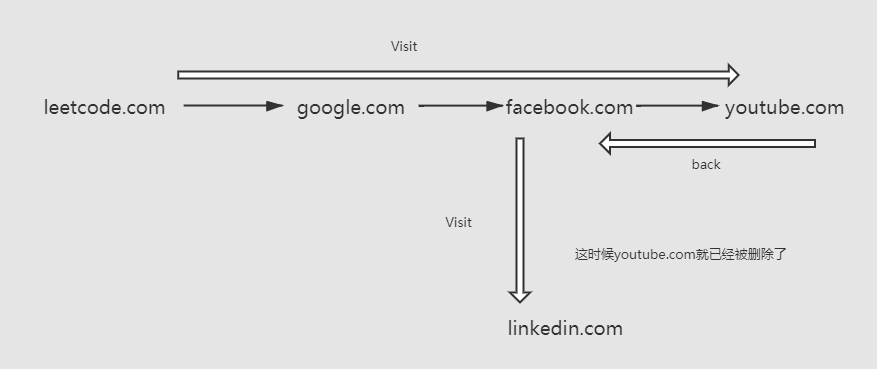

战果2/4，还有一题超时
<!-- more -->
#### 重新排列数组

这题是easy，通过对i%2==0来判断是添加start或者mid

```go
func shuffle(nums \[\]int, n int) \[\]int {
   length := len(nums)
   mid := length/2
   start := 0
   res := make(\[\]int, 0)
   for i := 0 ; i < length ; i++ {
      if i % 2 == 0  i == 0 {
         res = append(res, nums\[start\])
         start++
      }else {
         res = append(res, nums\[mid\])
         mid++
      }
   }
   return res
}
```


####  数组中的 k 个最强值

首先题目给我们重新定义一个排序的方法，因此这道题实际上是考我们排序，所以这题可以用的排序方法有很多种，在一开始做这道题时，我使用了冒泡排序结果超时了，后来转为使用快慢指针的方法来进行排序。

```go
func getStrongest(arr \[\]int, k int) \[\]int {
   var ans = make(\[\]int, k)
   sort.Ints(arr)
   n := len(arr)
   mid := arr\[(n-1)/2\]
   left, right := 0, n - 1
   for i := 0; i < k; i++ {
      hdiff, ldiff := arr\[right\]-mid, mid-arr\[left\]
      if hdiff >= ldiff {
         ans\[i\] = arr\[right\]
         right--
      } else {
         ans\[i\] = arr\[left\]
         left++
      }
   }
   return ans
}
```


#### 设计浏览器历史记录

这一题一定要清楚流程图，如下图：  因此我第一时间就想到了这应该是跟链表的那种形式，但更好的办法是使用数组的方式来进行类似链表的操作，代码由于过长，感兴趣的可以去[我的GitHub](https://github.com/MrVWY/LeetCode-Study)查看  

#### 总结

仍需加油！！！