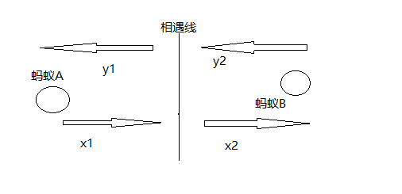

战果不佳....题目很长，想的太复杂。
<!-- more -->
### 5453\. 所有蚂蚁掉下来前的最后一刻

这题思路也十分简单，关键是你要理清几个关键点。 第一点，在两只蚂蚁相遇时它们就反方向前进，这里可以看成依旧按照原来方向前进，具体解释如下图：  

由上图可知，蚂蚁A来回的距离位x1+y1，但是这里我们可以看出x1+x2，这就相当于在相遇线之后题目说是两只蚂蚁反方向走，但是我们可以看出蚂蚁A和蚂蚁B交换了身份，但是本质是不变的，两只蚂蚁到最后都会走出木板。因此答案却决于两只蚂蚁的位置了。 因此理解了上图那么该题我们只需要关注的点是在最左边向右，最右边向左的两只蚂蚁，因此木板上没有蚂蚁的时刻，全都取决于在边缘上的两只蚂蚁，求出它们当中走完全程的最大值即可。

```go
//方法一
func getLastMoment(n int, left []int, right []int) int {
   maxs := 0
   for _, v := range left {
      maxs = max(maxs, v)
   }
   for _, v := range right {
      maxs = max(maxs, n-v)
   }
   return maxs
}

//方法二
//过滤2个数组中相邻的两个点（也就是会相遇的两只蚂蚁）
func getLastMoment(n int, left []int, right []int) int {
   sort.Ints(left)
   sort.Ints(right)

   if len(left) == 0 && len(right) == 0 {
      return 0
   }
   //向右为零
   if len(right) == 0 {
      return left[len(left)-1]
   }
   //向左为零
   if len(left) == 0 {
      return n-right[0]
   }

   maxs := -1
   for i := len(right)-1 ; i>=0 ; i-- {
      for j := 0 ; j < len(left) ; j++ {
         if left[j] >= right[i] {
            maxs = max(maxs, n - right[i])
            maxs = max(maxs, left[j])
            left[j] = -1
            right[i] = -1
            break
         }
      }
   }

   for i := 0 ; i < len(right) ; i++ {
      if right[i] != -1 {
         maxs = max(maxs, n-right[i])
      }
   }

   for i := 0 ; i < len(left) ; i++ {
      if left[i] != -1 {
         maxs = max(maxs, left[i])
      }
   }

   return maxs
}
```


### 5454\. 统计全 1 子矩形

主要思路是，不要顺着走，要逆着走。要算n\*n的矩形，首先要知道当前(i，j)的长度为多少吧，因此先从左到右计算出每一个(i，j)位置的最大长度为多少。接着把每个点都当成一个矩形的右下角，从每一行开始向上计算最大宽度，最后把结果累加即可。详细解释请看代码。

```go
func numSubmat(mat [][]int) int {
   row := len(mat)
   col := len(mat[0])
   //从左到右,计算出第i个位置的最大长度weight
   for i := 0 ; i < row ; i++ {
      l := 0
      for j := 0 ; j < col ; j++ {
         if mat[i][j] == 1 {
            l++
         }else {
            //说明前面有0,应该把长度重新置位1
            l = 0
         }
         mat[i][j] = l
      }
   }

   total := 0
   //从下到上, 计算高度height
   for i := 0 ; i < row ; i++ {//第i行
      for j := 0 ; j < col ; j++{//第j个
         min := math.MaxInt32
         for k := i ; k >=0 ; k-- {//高度,从下到上
            min = mins(min, mat[k][j])
            if min == 0 {//说明再从下到上的过程中遇到了0,应该立即停止接着下一个
               break
            }
            total += min
         }
      }
   }

   return total
}

func mins(a, b int) int {
   if a > b {
      return b
   }
   return a
}
```

