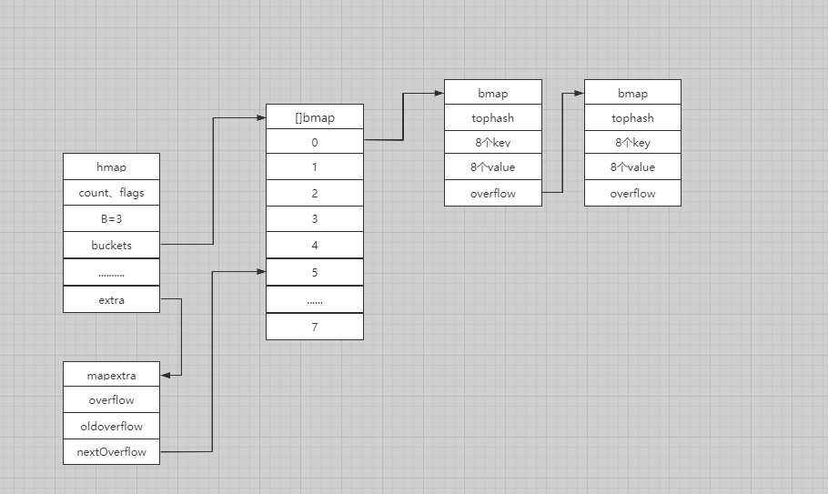
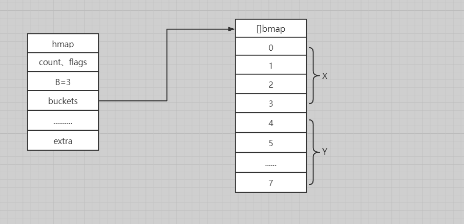

### map结构

#### hmap

在Go中hmap是map的主要结构体，在这主要关注字段B、buckets、oldbuckets。

```go
type hmap struct {
   count     int // 元素个数，len()
   flags     uint8
   B         uint8  //  2^B = 桶的个数
   noverflow uint16 // 溢出桶的大概数量
   hash0     uint32 // hash seed 哈希函数的”种子“，

   buckets    unsafe.Pointer // 指向buckets数组，大小为2^B
   oldbuckets unsafe.Pointer // 旧buckets，发生在bucket需要增大的情况下
   nevacuate  uintptr //已经搬迁了的桶数--搬迁进度
   extra *mapextra  
}
```

flag标记位

```go
// flags
iterator     = 1 // 当前有迭代器在使用buckets
oldIterator  = 2 // 当前有迭代器在使用oldbuckets
hashWriting  = 4 //当前有goroutine在对map进行写操作
sameSizeGrow = 8 //等量增长
```


#### mapextra

```go
type mapextra struct {
   overflow    *[]*bmap
   oldoverflow *[]*bmap

   // nextOverflow holds a pointer to a free overflow bucket.
   nextOverflow *bmap
}
```


#### bmap

在hmap中的buckets字段是个指针，其指向了bmap，buckerCnt = 1<<3 = 8。另外bmap结构中存放的是tophash（高位哈希）,它包括此存储桶的每个键的哈希值的最高位。 Tip:在bmap中8个key-value的排序，是8个key紧接着8个value这样的排序，这里就引出了一个**内存对齐**的概念，如果有兴趣请移步此[视频](https://www.bilibili.com/video/BV1Ja4y1i7AF)了解。

```go
const {
   // Maximum number of key/elem pairs a bucket can hold.
   bucketCntBits = 3
   bucketCnt     = 1 << bucketCntBits 
}

type bmap struct {
   tophash [bucketCnt]uint8
}
```

但是在查阅Google之后，Go在编译期间会给这个bmap加料，这便解决了我的一个疑惑：它里面的overflow字段哪来的。 加料之后的bmap：

```go
type bmap struct {
   topbits  [8]uint8
   keys     [8]keytype
   values   [8]valuetype
   pad      uintptr
   overflow uintptr
}
```


#### hiter

哈希迭代器，从字段和Google查询中，不难判断，这个hiter应该时与在hmap扩容时，对map的遍历相关联的。

```go
type hiter struct {
   key         unsafe.Pointer // key字段
   elem        unsafe.Pointer  //value字段
   t           *maptype
   h           *hmap
   buckets     unsafe.Pointer // 初始化时指向的buckets
   bptr        *bmap          // 当前指向的buckets
   overflow    *[]*bmap       
   oldoverflow *[]*bmap      
   startBucket uintptr        // 开始遍历时的编号
   offset      uint8          // 偏移量
   wrapped     bool           // 是否已经从头开始遍历
   B           uint8          //hmap中的B
   i           uint8
   bucket      uintptr
   checkBucket uintptr
}
```


#### 结构图

  

#### 小结

在处理哈希函数时，一定会遇到哈希冲突的问题，一般的解决方法是开放地址法和拉链法。而这里Go中就采用了拉链法，在编译期间给bmap后面增加了一个字段overflow来连接着产生哈希冲突的bmap。另外bmap中key和value的排放位置也十分讲究，这里就引出了这个内存对齐的概念就不详细讲述。

### 初始化

makemap返回的也是一个\*hmap

```go
func makemap(t *maptype, hint int, h *hmap) *hmap {
   mem, overflow := math.MulUintptr(uintptr(hint), t.bucket.size)
   if overflow  mem > maxAlloc {
      hint = 0
   }

   // 初始化 Hmap
   if h == nil {
      h = new(hmap)
   }
   // 获取一个随机哈希种子
   h.hash0 = fastrand()

   // 根据hint，计算B
   B := uint8(0)
   for overLoadFactor(hint, B) {
      B++
   }
   h.B = B

   // 创建buckets
   if h.B != 0 {
      var nextOverflow *bmap
      h.buckets, nextOverflow = **makeBucketArray**(t, h.B, nil)
      if nextOverflow != nil {
         h.extra = new(mapextra)
         h.extra.nextOverflow = nextOverflow
      }
   }

   return h
}
```


### 读写操作

#### 访问

访问操作主要有2种函数分别是：mapaccess1和mapaccess2。俩者的区别是前一个是不到bool类型的返回，后一个是带bool类型的返回。

```
a := A['A'] //mapaccess1
a, ok := A['A'] //mapaccess2
```

流程：先根据key计算hash，然后计算获得所对应的桶地址b。接着对桶进行遍历。

```go
func mapaccess1(t *maptype, h *hmap, key unsafe.Pointer) unsafe.Pointer {
   .........
   alg := t.key.alg
   hash := alg.hash(key, uintptr(h.hash0)) // 计算hash
   m := bucketMask(h.B) //返回 1<<B - 1
   //计算桶的地址
   b := (*bmap)(add(h.buckets, *(hash & m)*uintptr(t.bucketsize))) 
   top := tophash(hash) //计算高位的哈希值(tophash)

bucketloop:
   //先从正常桶遍历，再从溢出桶遍历
   for ; b != nil; b = b.overflow(t) {
      //bucketCnt = 8
      for i := uintptr(0); i < bucketCnt; i++ {
         if b.tophash[i] != top {
            if b.tophash[i] == emptyRest {
               break bucketloop
            }
            continue
         }
         k := add(unsafe.Pointer(b), dataOffset+i*uintptr(t.keysize))
         // 判断是否符合
         if alg.equal(key, k) {
            // 计算k对于的value地址
            e := add(unsafe.Pointer(b), dataOffset+bucketCnt*uintptr(t.keysize)+i*uintptr(t.elemsize))
            return e
         }
      }
   }
   // 找不到输出nil
   return unsafe.Pointer(&zeroVal[0])
}
```

代码整体来说算是直接。

#### 写入

```go
func mapassign(t *maptype, h *hmap, key unsafe.Pointer) unsafe.Pointer {
   //计算哈希值和桶的位置
   alg := t.key.alg
   hash := alg.hash(key, uintptr(h.hash0))
   h.flags ^= hashWriting

again:
   bucket := hash & bucketMask(h.B)
   if h.growing() { // 判断当前map是否在扩容
      growWork(t, h, bucket)
   }
   b := (*bmap)(unsafe.Pointer(uintptr(h.buckets) + bucket*uintptr(t.bucketsize)))
   top := tophash(hash)
```

遍历比较桶的hash和key，查找对应的key

```go
var inserti *uint8   //索引
var insertk unsafe.Pointer //键
var elem unsafe.Pointer  //值
bucketloop:
   for {
      for i := uintptr(0); i < bucketCnt; i++ {
         //判断tophash是否相等
         if b.tophash[i] != top {
            if isEmpty(b.tophash[i]) && inserti == nil {
               inserti = &b.tophash[i]
               insertk = add(unsafe.Pointer(b), dataOffset+i*uintptr(t.keysize))
               elem = add(unsafe.Pointer(b), dataOffset+bucketCnt*uintptr(t.keysize)+i*uintptr(t.elemsize))
            }
            if b.tophash[i] == emptyRest {
               break bucketloop
            }
            continue
         }
         k := add(unsafe.Pointer(b), dataOffset+i*uintptr(t.keysize))

     //判断key是否相等
     if !alg.equal(key, k) {
        continue
     }
     // 如果当前key已经存在value，则更新
     if t.needkeyupdate() {
        typedmemmove(t.key, k, key)
     }
     elem = add(unsafe.Pointer(b), dataOffset+bucketCnt*uintptr(t.keysize)+i*uintptr(t.elemsize))
     goto done //转到done流程
  }
  //切换到溢出桶遍历
  ovf := b.overflow(t)
  if ovf == nil {
     break
  }
  b = ovf
}
```

如果当前桶满了，就会创建一个newoverflow

```go
if inserti == nil {
   newb := h.newoverflow(t, b)
   inserti = &newb.tophash[0]
   insertk = add(unsafe.Pointer(newb), dataOffset)
   elem = add(insertk, bucketCnt*uintptr(t.keysize))
}
typedmemmove(t.key, insertk, key)
*inserti = top
h.count++
```


#### 扩容

由于Go中的map是由哈希表构成，当查找key时，它先定位到某个buckets再定位到其中的key。涉及到哈希表，那么必定会牵扯到哈希表的装载因子。在这里Go是这样定义装载因子。

##### 扩容条件

mapassign函数触发扩容条件：

1.  当装载因子超过6.5
2.  当溢出桶过多时

触发扩容相关的函数

//判断装载因子是否超过6.5

```go
func overLoadFactor(count int, B uint8) bool {
   return count > bucketCnt && uintptr(count) > loadFactorNum*(bucketShift(B)/loadFactorDen)
}
```

//溢出桶过多

```go
func tooManyOverflowBuckets(noverflow uint16, B uint8) bool {
   if B > 15 {
      B = 15
   }
   return noverflow >= uint16(1)<<(B&15)
}
```

根据触发条件的不同所对应的扩容条件，扩容方式也会不同。第一种是因为元素多，桶少。第二种是因为元素少，桶多，例如当向map不断的插入数据并把他们删除，这会造成溢出桶不断增加，而到了最后溢出桶太多但是元素却很少的情况。

##### buckets的搬迁

hashGrow函数主要是对创建一些溢出桶，具体的搬迁操作位于growWork() 和 evacuate()

```go
func hashGrow(t *maptype, h *hmap) {
   bigger := uint8(1)
   if !overLoadFactor(h.count+1, h.B) {
      bigger = 0
      h.flags = sameSizeGrow
   }
   //将旧的buckets挂到oldbuckets
   oldbuckets := h.buckets
   //创建溢出桶
   newbuckets, nextOverflow := makeBucketArray(t, h.B+bigger, nil)
   //更新标记位
   flags := h.flags &^ (iterator  oldIterator)
   if h.flags&iterator != 0 {
      flags = oldIterator
   }

   h.B += bigger
   h.flags = flags
   h.oldbuckets = oldbuckets
   h.buckets = newbuckets
   //更新进度
   h.nevacuate = 0
   h.noverflow = 0

   .........
}
```


##### evacDst

evacDst是表示搬迁后的目的地址的一个结构体

```go
type evacDst struct {
   b *bmap          //当前目的buckets
   i int            // 指向当前key/value的index b
   k unsafe.Pointer // 指向当前key
   e unsafe.Pointer // 指向当前value
}
```


##### evacuate

```go
func evacuate(t *maptype, h *hmap, oldbucket uintptr) {
   //找出旧的buckets
   b := (*bmap)(add(h.oldbuckets, oldbucket*uintptr(t.bucketsize)))
   newbit := h.noldbuckets() //计算当前map的存储桶的数量
   if !evacuated(b) {

  //搬迁地址
  **var xy [2]evacDst**
  x := &xy[0]
  x.b = (*bmap)(add(h.buckets, oldbucket*uintptr(t.bucketsize)))
  x.k = add(unsafe.Pointer(x.b), dataOffset)
  x.e = add(x.k, bucketCnt*uintptr(t.keysize))

  //判断当前是否是增加相等的map大小
  if !h.sameSizeGrow() {
     y := &xy[1]
     y.b = (*bmap)(add(h.buckets, (oldbucket+newbit)*uintptr(t.bucketsize)))
     y.k = add(unsafe.Pointer(y.b), dataOffset)
     y.e = add(y.k, bucketCnt*uintptr(t.keysize))
  }
  //遍历所有的buckets
  for ; b != nil; b = b.overflow(t) {
     k := add(unsafe.Pointer(b), dataOffset)   //原key
     e := add(k, bucketCnt*uintptr(t.keysize)) //原value
     for i := 0; i < bucketCnt; i, k, e = i+1, add(k, uintptr(t.keysize)), add(e, uintptr(t.elemsize)) {
        top := b.tophash[i]
        //判断当前cell是否为空
        if isEmpty(top) {
           b.tophash[i] = evacuatedEmpty //标志为已经被搬空
           continue
        }
        if top < minTopHash {
           throw("bad map state")
        }
        k2 := k
        if t.indirectkey() {
           k2 = *((*unsafe.Pointer)(k2))
        }
        var useY uint8
        if !h.sameSizeGrow() {
           //通过计算hash来确认目的地址是前半部分x或者是后半部分y
           hash := t.key.alg.hash(k2, uintptr(h.hash0))
           if h.flags&iterator != 0 && !t.reflexivekey() && !t.key.alg.equal(k2, k2) {
              useY = top & 1
              top = tophash(hash)
           } else {
              if hash&newbit != 0 {
                 useY = 1
              }
           }
        }
        //这里不太理解具体意思
       ** b.tophash[i] = evacuatedX + useY // evacuatedX + 1 == evacuatedY**
        dst := &xy[useY]                 // 目的地址

        if dst.i == bucketCnt {
           dst.b = h.newoverflow(t, dst.b)
           dst.i = 0
           dst.k = add(unsafe.Pointer(dst.b), dataOffset)
           dst.e = add(dst.k, bucketCnt\*uintptr(t.keysize))
        }
        dst.b.tophash\[dst.i&(bucketCnt-1)\] = top
        //迁移key
        if t.indirectkey() {
          *(\*unsafe.Pointer)(dst.k) = k2
        } else {
           typedmemmove(t.key, dst.k, k)
        }
        //迁移value
        if t.indirectelem() {
           *(*unsafe.Pointer)(dst.e) = *(*unsafe.Pointer)(e)
        } else {
           typedmemmove(t.elem, dst.e, e)
        }
        dst.i++
        dst.k = add(dst.k, uintptr(t.keysize))
        dst.e = add(dst.e, uintptr(t.elemsize))
     }
  }

   if oldbucket == h.nevacuate {
      advanceEvacuationMark(h, t, newbit) //更新搬迁进度
   }
}
```

这里有一个点需要注意，在上述evacuated函数加粗的代码，它定义了xy \[2\]evacDst，里面只含2个evacDst，同时结合上面所定义的cell的状态，可以推测在搬迁过程中，把原来的buckets看出X，而后来等量扩容的部分看成Y，如下图所示。  正因为如此，在搬迁的过程中，由于所计算的地址可能会跟原来的不同，map的遍历是按顺序遍历的，扩容之后有的key就可能被迁移到溢出桶那边，因此map的遍历是无序的。

#### 删除

map的删除是由mapdelete函数来完成，也是两层循环，从正常桶到溢出桶查找对应的key（查找过程和访问过程类似），删除时先删除key再删除value。如果当前map正在扩容那么删除操作会在扩容之后执行。

```go
if h.growing() {
   growWork(t, h, bucket)
}
......
//将key清零
if t.indirectkey() {
  *(*unsafe.Pointer)(k) = nil
} else if t.key.ptrdata != 0 {
  memclrHasPointers(k, t.key.size)
}

e := add(unsafe.Pointer(b), dataOffset+bucketCnt\*uintptr(t.keysize)+i\*uintptr(t.elemsize))
//对value清零
if t.indirectelem() {
  *(*unsafe.Pointer)(e) = nil
} else if t.elem.ptrdata != 0 {
  memclrHasPointers(e, t.elem.size)
} else {
  memclrNoHeapPointers(e, t.elem.size)
}
........
```


### 总结

Go使用拉链法来解决哈希碰撞来实现哈希表。哈希值在每一个桶中存储对应的哈希值的前8位，每一个桶只能存放8个key/value，一旦超过，新的key/value会被存储到溢出桶中。之后随着key/value的增加，溢出桶的数量和装载因子也会升高，这时候就会触发扩容机制，对key/value迁移到不同的桶中。