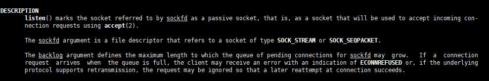
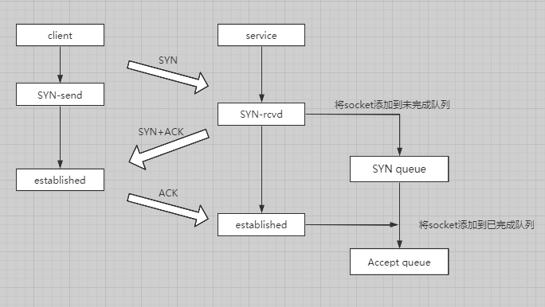

在了解了nginx  reuseport和backlog参数之后，发现其内部原理不光涉及到nginx这一表面，还和TCP连接中SYN queue，Accept queue相关，同时也涉及到linux的socket复用。
<!-- more -->

### nginx listen参数

下面为listen的配置格式以及参数

`**listen** _address_[:_port_] [default_server] [ssl] [http2  spdy] [proxy_protocol] [setfib=_number_] [fastopen=_number_] [backlog=_number_] [rcvbuf=_size_] [sndbuf=_size_] [accept_filter=_filter_] [deferred] [bind] [ipv6only=onoff] [reuseport] [so_keepalive=onoff[_keepidle_]:[_keepintvl_]:[_keepcnt_]];`

这篇文章主要讲述reuseport和backlog参数，其他的可以自行去官网查询，同时文档会放在Reference中

#### reuseport

reuseport参数，官网的解释有点模糊。不过去Google一下发现这参数与linux的SO\_REUSEPORT参数有关。百度上大多数叫法是socket重用，也贴近这个reuse port 这个名称。 在linux系统中一切皆文件，而一个socket则对应一个IP-Port，而so\_reuseport这个参数可以使得多个socket bind()/listen()同一个TCP/UDP端口，这就意味着每一个进程都可以拥有自己的socket从而提高了服务器的性能，把以前的一个进程处理多个客户变成了多个进程处理多个客户的这样一种改变。同时多个进程都拥有了自己的socket，就不必再去争抢了，也避免了锁的竞争。

#### backlog参数

backlog参数只要是设置linux系统的accept queue。在TCP建立连接时会维护两个队列分别为SYN queue(待完成连接队列)和accept queue(已完成连接队列)。

*   SYN队列：当客户端第一次发送SYN包时，服务器回应SYN+ACK之后，等待客户端的ACK，这时候就会将这天待完成的连接放进SYN队列中。
*   Accept队列：当客户端回应ACK之后，两边都是出于established状态，服务器就会从SYN队列将连接取出加入到当前队列。

那么问题来了，既然有队列那么肯定会涉及到队列要设置多长才合适的问题。因此backlog参数就是用来设置accept队列的长度。 当accept队列满了之后，可能会涉及到SYN队列的连接，如果其中一条连接想加入到accept队列(即客户端回应ACK)，那么可能就会忽略这个ack包或者等待触发重发机制-重发SYN+ack。因此设置好backlog也是极为关键的一点。 在TCP/IP详解卷三的14.5中提到，当队列满了情况下，服务器会自动丢弃连接请求，这里看得有点懵。通过Google一下发现backlog在linux2.2之前是用来指定待完成的连接请求也就是SYN queue，而accpet queue的数量则是用tcp\_max\_tw\_buckets设置，而2.2版本之后就改为知道accept queue的长度。 通过man listen命令可以得知，当队列满了的情况下，客户端可能会收到带有ECONNREFUSED指示的错误，或者如果基础协议支持重传，则可以忽略该请求，以便以后在连接时重新尝试成功。  补一张自己画的图： 

### 总结

nignx listen的reuseport与backlog配置其实并不难，但还是要了解一下主要用途和涉及的一些知识点。

### Reference

*   [socket(7) — Linux manual page](https://man7.org/linux/man-pages/man7/socket.7.html)
*   [SYN packet handling in the wild](https://blog.cloudflare.com/syn-packet-handling-in-the-wild/)
*   [TCP三次握手之backlog](https://mp.weixin.qq.com/s?__biz=MjM5NzUwNDA5MA==&mid=201005717&idx=1&sn=74036633114ee6212e57ee4576dbfcbc&3rd=MzA3MDU4NTYzMw==&scene=6#rd)
*   [How do SO\_REUSEADDR and SO\_REUSEPORT differ?](https://stackoverflow.com/questions/14388706/how-do-so-reuseaddr-and-so-reuseport-differ)
*   [nginx文档](http://nginx.org/en/docs/http/ngx_http_core_module.html#listen)
*   [What is the difference between tcp\_max\_syn\_backlog and somaxconn?](https://stackoverflow.com/questions/62641621/what-is-the-difference-between-tcp-max-syn-backlog-and-somaxconn)