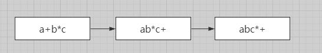

Reverse Polish Notationye也称逆波兰表达式(后缀表达式)。
<!-- more -->
### 前、中、后缀表达式

所谓的前、中、后缀表达式也十分简单，复杂点的可以把a、b看出2个不同的运算表达式，如下： 前缀表达式：+ab 中缀表达式：a+b 后缀表达式：ab+

#### 中缀变后缀例子1

a+b\*c

根据上面的中缀表达式。首先我们把a、b\*c看成2个整体，这样就回到了一开始的a+b模式。a+b\*c就变为了ab\*c+，接着还剩b\*c这一部分思路一样，ab\*c+就变为了abc\*+。  经过上面的例子，可以大致了解中缀变后缀的基本流程。

#### 中缀变后缀例子2

(a\*b+c)\*d

根据上面的中缀表达式。首先我们把(a\*b+c)、d看成2个整体，这样就回到了一开始的a+b模式。(a\*b+c)\*d就变为了(a\*b+c)d\*，接着还剩(a\*b+c)这一部分思路一样，(a\*b+c)就变为了abc\*+，接上前面的d\*，整个中缀变后缀的结果为abc\*+d\*。

### 中缀变后缀代码实现

根据前面的2个例子，可以使用一个存储数字的num数组和一个存储运算符的stack栈。

#### 具体流程如下：

1.  遍历中缀表达式ch，**如果遇到"("**，就直接入栈。**如果遇到数字**，将其存储到num数组并用**空格隔开**。**如果遇到")"**，将栈上的运算符全部添加到num数组中，"("除外，最后遍历到"("需要将其从栈上删除。
2.  如果遇到运算符，这里分2种情况：

第一种情况，如果当前ch的字符比栈顶元素的运算符的优先级**大**，那么当前ch的字符入栈。 第二种情况，如果当前ch的字符比栈顶元素的运算符的优先级**小并且栈顶元素不为"("**，那么将栈顶元素取出添加到num数组中，直到当前ch的字符比栈顶元素的运算符的优先级大，然后当前ch的字符入栈。

#### 代码实现

//比较运算符的优先级

```go
func getPriority(ch byte) int {
   priority := 0
   switch ch {
      case '+': priority = 1
      case '-': priority = 1
      case '(': priority = 2
      case '/': priority = 3
      case '\*': priority = 3
      default:
         priority = 0
   }
   return priority
}
```

//中缀变后缀

```go
func changeRPN(ch string) string {
   nums := make([]byte,0) //store number
   stack := make([]byte,0) //store operator
   for i := 0 ; i < len(ch) ; i++ {
      if ch[i] == ' ' {continue} //分隔符
      if ch[i] >= '0' && ch[i] <= '9' {
         //如果是二位数以上
         for i < len(ch) && ch[i] >= '0' && ch[i] <= '9' {
            nums = append(nums, ch[i])
            i++
         }
         nums = append(nums, ' ') //分隔符,不然会出现11\*2 -> 112\*
         i--
      }

  if ch[i] == '(' {
     //直接入栈
     stack = append(stack, ch[i])
  }else if ch[i] == ')' {
     //将括号中间的符号输出到尾部
     for len(stack) != 0 {
        top := stack[len(stack)-1]
        if top == '(' {
           stack = stack[:len(stack)-1]
           break
        }
        nums = append(nums, top)
        nums = append(nums, ' ')
        stack = stack[:len(stack)-1]
     }
  }

  if ch[i] == '+'  ch[i] == '-'  ch[i] == '\*'  ch[i] == '/' {
     if len(stack) == 0 {
        stack = append(stack, ch[i])
     }else {
        if getPriority(ch[i]) > getPriority(stack[len(stack)-1]) {
           stack = append(stack, ch[i])
        }else {
           //如果当前运算符优先级比运算栈栈顶的运算符优先级小,将栈顶运算符输出到尾部
           for len(stack) != 0 && getPriority(ch[i]) <= getPriority(stack[len(stack)-1]) && stack[len(stack)-1] != '(' {
              nums = append(nums, stack[len(stack)-1])
              nums = append(nums, ' ')
              stack = stack[:len(stack)-1]
           }
           stack = append(stack, ch[i])
        }
     }
  }
 }
   for len(stack) != 0 {
      nums = append(nums, stack[len(stack)-1])
      nums = append(nums, ' ')
      stack = stack[:len(stack)-1]
   }

   result := ""
   for i := 0 ; i < len(nums) ; i++ {
      result += string(nums[i])
   }
   return result
}
```


### 后缀表达式计算

#### 具体流程

首先需要一个存储数字的stack栈，当遇到运算符时，只需要将栈上的2个元素取出计算，再将求出的值放进栈中即可。最后我们只需要输出栈顶元素就得出答案。 注意：2个数字之间是用空格隔开的，因此上面转后缀时我们已经处理好了，是为了避免1\*12变成112\*的误区，使得不清楚是1\*12还是11\*2。处理好的1\*12为1 12 \*。

#### 代码实现

```go
func calculateRPN(ch string) int {
   length := len(ch)
   var value1, value2, result int
   stack := make([]int,0)
   for i := 0 ; i < length ; i++ {
      if ch[i] >= '0' && ch[i] <= '9' {
         tmp := int(ch[i] - 48)
         j := i+1
         for ch[j] >= '0' && ch[j] <= '9' {
            tmp = tmp * 10 + int(ch[j] - 48)
            j++
         }
         stack = append(stack, tmp)
         i = j-1
      }
      if ch[i] == '+'  ch[i] == '-'  ch[i] == '*'  ch[i] == '/' {
         value2 = stack[len(stack)-1]
         stack = stack[:len(stack)-1]
         value1 = stack[len(stack)-1]
         stack = stack[:len(stack)-1]
         if ch[i] == '+' { result = value1+value2
         }else if ch[i] == '-' {result = value1-value2
         }else if ch[i] == '\*' {result = value1*value2
         }else if ch[i] == '/' {result = value1/value2}
         stack = append(stack, result)
      }
   }
   return stack[len(stack)-1]
}
```


### 总结

逆波兰表达式的操作与思路实现起来不算太难，主要思路要理解的。