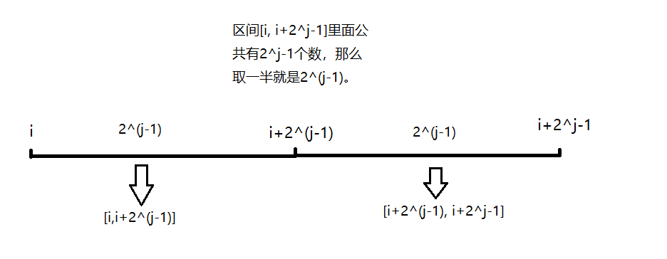

范围最值查询方法(RMQ)
<!-- more -->
### RMQ解决什么问题

比如现在由区间为\[l,r\]的数组，求当中的最大或者最小值。一般通常思路都是for循环遍历数组找最大或者最小值，时间复杂度为O(n)，但是对于区间不算大还好，如果该区间很大很大，那么就要考虑这种方法是否可用了。而RMQ能够在该区间内查询到结果，时间复杂度为O(N)~O(logN)。

### RMQ思想

关于RMQ的伪代码和计算方式，在[Wikipedia](https://zh.wikipedia.org/wiki/%E8%8C%83%E5%9B%B4%E6%9C%80%E5%80%BC%E6%9F%A5%E8%AF%A2)上有就不重复了。关键是理清楚里面的范围变化。 RMQ使用二维数组dp\[i\]\[j\]来表示范围\[i, i+2^j-1\]中的最大/最小值。在Wikipedia上计算时要把\[i, i+2^j-1\]分成2段来求解，至于具体在Wikipedia上的伪代码(如下所示)是扎弄得，请看下图。

F\[i\]\[j \- 1\], F\[i + (1 << (j \- 1))\]\[j \- 1]

 还是顺便贴一下伪代码把，因此有个地方需要了解注意

```
// 长度为 0 时，表示数据自身。
for (int i = 0; i < Length; ++i) F[i][0] = Array[i];

for (int j = 1; (1 << j) <= Length; ++j)
 for (int i = 0; i + (1 << j) - 1 < Length; ++i)
F[i][j] = min(
   F[i][j - 1], F[i + (1 << (j - 1))][j - 1]
); // 分成长度相等的两段
```

这里可以注意到伪代码的for循环是先j再i，而不是一般的先i再j。比如说求最大值，首先我们先两两比较 (1,2),(3,4)....，然后再从其中两两比较的结果再比较最大值，说白了得到了1个区间(含有2个数)的最大值就可以求出2个区间的最大值(各含有2个数)，而那么小的数便不再理会只关注区间中的最大值就可以推出总的区间最大值。因此如果先i再j，那么就变成前i个元素的最值，但是前i个元素的最值可能是由几个不同的区间所求的因此这时候就无法求的结果。

#### 查询

如果你理解了上面的，就会发现RMQ的主要思想是从2个区间的最值求出一个区间的最值。因此对于查询区间里的最值，核心思想是比较两大半区间的最值即可。

```
//核心代码，其中i是中位数那个位置也就是区间总长度/2
min(F[Left][i], F[Right - (1 << i) + 1][i]);
```

