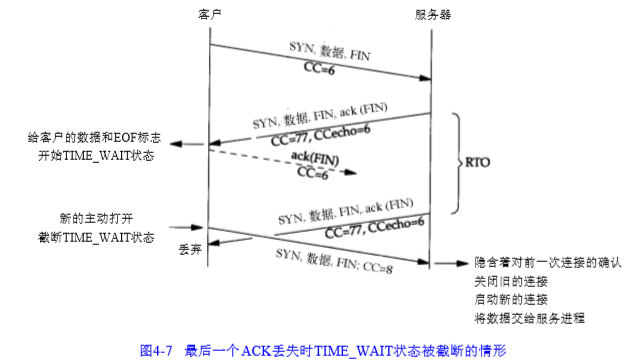

最近在TCP卷3中看到了一个time\_wait状态截断，引起了我的注意。同时也注意到了TCP重置攻击方法。
<!-- more -->
### time\_wait状态截断

目前time\_wait状态截断只要是作用于T/TCP协议中。具体还是看图理解  由上图可知在客户与服务器之间的交互的过程中，比较TCP/IP协议，其多发送了FIN。 这个time\_wait状态截断主要发生在上图的新连接主动打开这块，可以明显看出time\_wait直接被截。仔细观察结合卷3的解释，出现这情况是因此T/TCP新增的字段CC大于上一条连接(8>6)，于是就导致了老的连接关闭，新的连接开始建立。

#### 作用

作用通常是与性能或者内存所挂勾 根据卷3所知出现time\_wait截断的目的是为了重用本地端口以减少对控制块内存的需求。但前提是连接的持续时间小于报文段最大生存时间MSL。 不过T/TCP目前并没有成为一个标准和被应用，因此time\_wait状态的截断在平常是少见的。

### Reset attack

Reset attack其实就是利用了TCP中的RST字段。当处于正常的TCP连接的双方，任何一方收到了一个RST位为1的包，就会立即重置当前TCP连接，丢弃接收到的该连接的所有数据包，相当于终止了该TCP连接。应用方面有好也有坏，可以伪造RST报文到任意一方以达到破坏TCP连接为目的，也可以利用RST报文来中断TCP连接

### Reference

*   [TCP reset attack](https://en.wikipedia.org/wiki/TCP_reset_attack)
    
*   [T/TCP中的新TCP选项](https://bbs.huaweicloud.com/blogs/134377)
    
*   [How does a TCP Reset Attack work?](https://robertheaton.com/2020/04/27/how-does-a-tcp-reset-attack-work/)
    
*   [T/TCP](https://baike.baidu.com/item/T%2FTCP/1647857?fr=aladdin)