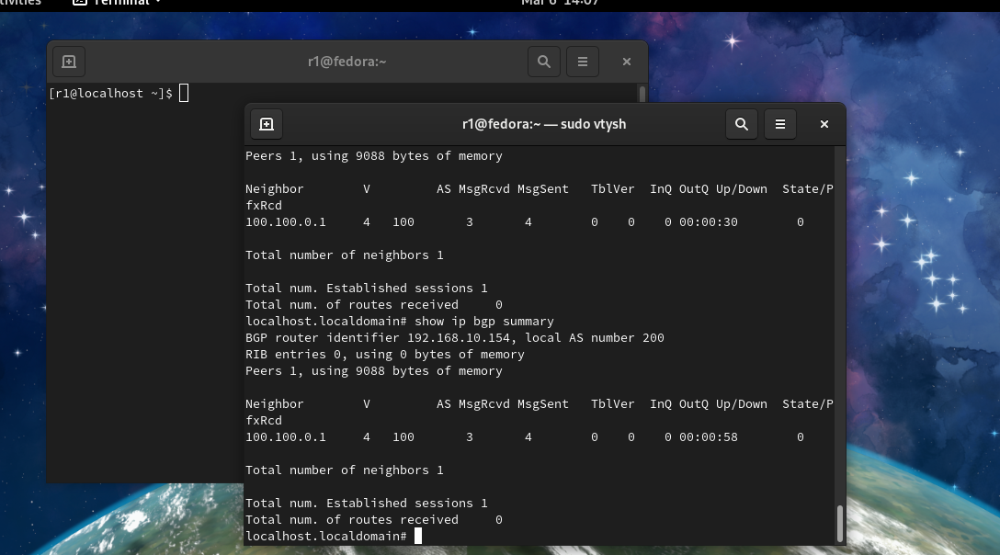
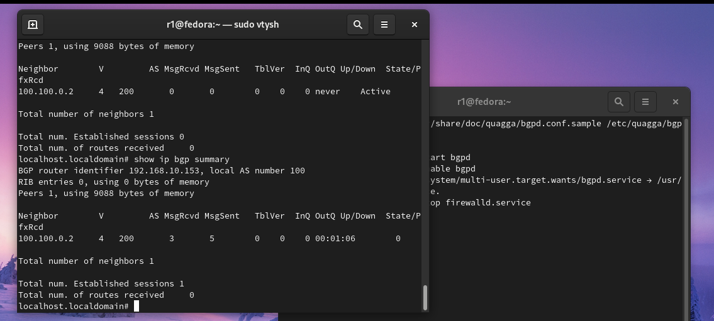

#### install

```
yum install quagga
```

然后就是出现2个文件路径，第一个是配置文件的例子，存放于/usr/share/doc/quagga-XXXXX。第二个是运行配置文件，存放于/etc/quagga。

#### 解除selinux限制

- 通过命令解除selinux限制

  ```
  setsebool -P zebra_write_config 1 
  ```

- 通过修改文件解除selinux限制

```
vim /etc/selinux/config 
```

修改SELINUX为disabled 

```

# This file controls the state of SELinux on the system.
# SELINUX= can take one of these three values:
#     enforcing - SELinux security policy is enforced.
#     permissive - SELinux prints warnings instead of enforcing.
#     disabled - No SELinux policy is loaded.
SELINUX=disabled 
# SELINUXTYPE= can take one of three values:
#     targeted - Targeted processes are protected,
#     minimum - Modification of targeted policy. Only selected processes are protected. 
#     mls - Multi Level Security protection.
SELINUXTYPE=targeted

```

#### 配置IP

##### 开启zebra

```
//创建Zebra配置文件
# cp /usr/share/doc/quagga-<your Specific flie name>/zebra.conf.sample /etc/quagga/zebra.conf 
```

```
# systemctl start zebra
# systemctl enable zebra 
```

##### 进入Quagga配置ip

```
# vtysh
# show interface
.......
# configure terminal
#(config) interface ××
#(config-if) ip address <ip>
#(config-if) description " "
#(config-if) no shutdown
#(config-if) exit
```

##### 确认配置

```
# show interface
Interface ens33 is up, line protocol detection is disabled
  Description: "to Router-B"
  index 2 metric 1 mtu 1500 
  flags: <UP,BROADCAST,RUNNING,MULTICAST>
  HWaddr: 00:0c:29:1f:32:55
  inet 100.100.0.1/30 broadcast 100.100.0.3
  inet 192.168.10.131/24 broadcast 192.168.10.255
  inet6 fe80::c936:37d7:559f:aa5e/64
  ......
# show interface description   
Interface       Status  Protocol  Description
ens33           up      unknown   "to Router-B"
.....
```

##### 保持配置

```
# write
Building Configuration...
Configuration saved to /etc/quagga/zebra.conf
Configuration saved to /etc/quagga/bgpd.conf
[OK]
```

#### 配置BGP

##### 开启bgpd

```
//创建bgpd配置文件
# cp /usr/share/doc/quagga-<your Specific flie name>/bgpd.conf.sample /etc/quagga/bgpd.conf 
```

```
# systemctl start bgpd
# systemctl enable bgpd
```

##### 进入Quagga配置bgp

```
# configure terminal
#(config) router bgp <asn>
#(config) no auto-summary
#(config) no synchronizaiton
#(config-router) neighbor <ip> remote-as <asn>
#(config-router) neighbor <ip> description ""
#(config-router) exit
#(config) exit
```

##### 保存配置

```
# write
Building Configuration...
Configuration saved to /etc/quagga/zebra.conf
Configuration saved to /etc/quagga/bgpd.conf
[OK]
```

##### 查看bgp连接建立情况

```
# show ip bgp summary
```





#### 发布路由前缀

##### 发布

```
# configure terminal
#(config) router bgp <asn>
#(config-router) network <ip>
#(config-router) exit
#(config) exit
```

##### 确认是否发布成功

```
# shou ip bgp summary
BGP router identifier 192.168.10.149, local AS number 200
RIB entries 3, using 336 bytes of memory
Peers 1, using 4560 bytes of memory

Neighbor        V    AS MsgRcvd MsgSent   TblVer  InQ OutQ Up/Down  State/PfxRcd
100.100.0.1     4   100      16      32        0    0    0 00:06:33        
1

Total number of neighbors 1
```

从State/PfxRcd字段看出由0到1的变化，表明发布成功

#### 发布BGP黑洞

利用Gobgp

sudo ./gobgpd -f gobgpd.conf -l debug -p


#### 后续

其实quagga配置命令和路由器厂商都差不多，并不难。个人还是跟着配置教程一步一步配置的。

#### question

- Can't backup old configuration file /etc/quagga/××.conf.sav.

  权限问题 chmod -R 777  /etc/quagga/

- 注意从/usr/share/doc/quagga-< your Specific flie name >路径下copy过来的文件要注意修改route-id，这小地方会导致后面bgp建立连接失败

#### Reference

- [想玩 BGP 路由器么？用 CentOS 做一个](https://linux.cn/article-4609-1.html)
- [Quagga Routing - Install, Configure and setup BGP](https://www.psychz.net/client/kb/en/quagga-routing--install-configure-and-setup-bgp.html#4)
- [quagga文档](chrome-extension://ikhdkkncnoglghljlkmcimlnlhkeamad/pdf-viewer/web/viewer.html?file=https%3A%2F%2Fwww.quagga.net%2Fdocs%2Fquagga.pdf)