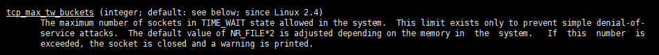
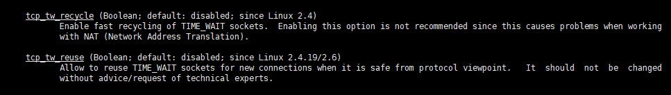

最近看到一个问题是关于TCP的短链接
<!-- more -->
### 问题

在一段时间里，有大量的短链接请求服务器，服务器会发生什么情况？

### time\_wait状态与可能导致情况

当TCP进入了四次挥手阶段，当主动请求关闭连接时就会在接下来的过程中进入time\_wait状态，其时长为2msl。具体就不多说，TCP三次握手和四次挥手都是基础知识。 那么会不会出现一种情况，当大量的短链接请求过来，但每条短链接请求的数据量都比较小，服务器飞速的处理完毕，这时候没有发生任何的错误，但是仍要等待2msl时间才能关闭结束TCP连接。因此思考一下，如果服务器处理时间为万分之2msl，那么这个在不发生任何包丢失的情况下，这个等待2msl时间是不是有点不合理？ 因此在有无数个短链接请求过来时，大量的socket都停留在了time\_wait状态导致服务器里的socket数量爆满(换句话说必须要等到2msl后才能释放)。

#### 可能会发生的情况

在linux中，有着对这种情况的解释，本人通过man tcp的命令找到里面对一个字段tcp\_max\_tw\_buckets解释如下图  这段话说明了当linux中处于time\_wait状态的socket一旦超过规定的值，就会导致部分socket关闭。

### 解决方法

关于解决方法网上已经有很多，不过主要还是涉及到几个参数分别为tcp\_tw\_reuse、tcp\_tw\_recycle，前者是对time\_wait socket重用，后者是对 time\_wait  socket的快速回收。  可以通过linux参数说明得知，当启动tcp\_tw\_recycle可以对socket快速回收但是当网络是在NAT的情况下，就可能会引起一系列问题，因此该参数要慎用。 不过一般情况下，服务器都是作为被动连接的一方，而tcp\_tw\_reuse这个参数是否开启主要还是基于你是主动发起还是被动连接，因为time\_wait状态只出现在主动发起一方。 注：查看当前TCP状态：netstat -an grep tcp

### Reference

*   [kernel.org (相关参数)](https://www.kernel.org/doc/Documentation/networking/ip-sysctl.txt)
*   [以讹传讹的“tcp\_tw\_reuse”](https://cloud.tencent.com/developer/article/1412003)