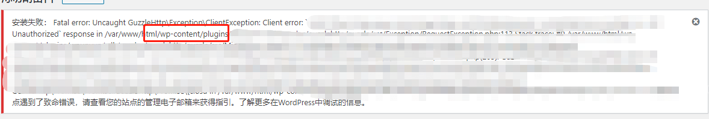

一天，我在安装一个wordpress插件时，发现了什么插件都安装不成功，一直提示安装失败：您的站点遇到了致命错误..
<!-- more -->
在网上查找许多帖子之后，我决定开启wordpress的DEBUG模式，显示详细的错误信息。 首先找到wordpress目录下的wp-config.php，在其后面添加一串代码：

define( 'WP\_DEBUG', true ); 
define( 'WP\_DEBUG\_LOG', true );
define( 'WP\_DEBUG\_DISPLAY', true );
@ini\_set( 'display\_errors', 'On' );

Tip: 最后别忘了结束之后要把DEBUG模式关掉 最后在显示的错误信息中，我发现了一丝蛛丝马迹，如下图：  原来是因为我的一个插件所导致的，最后我把这插件禁用了，解决问题，收工。